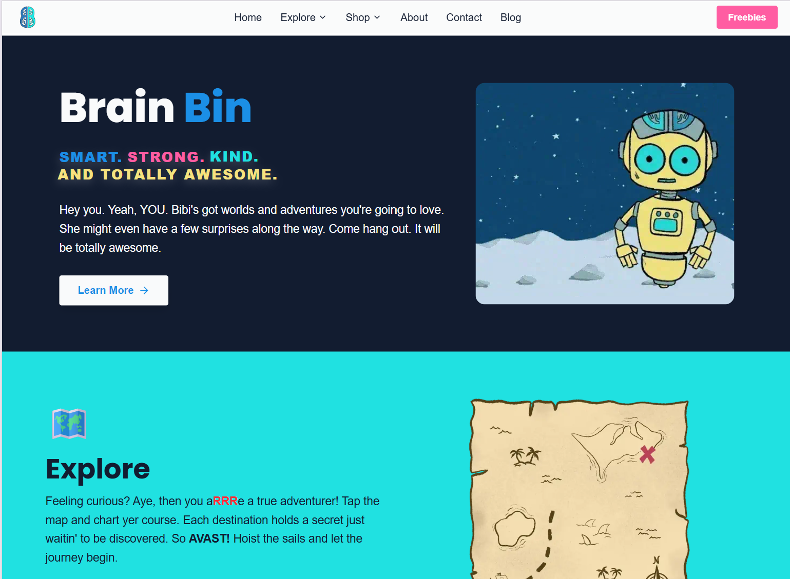
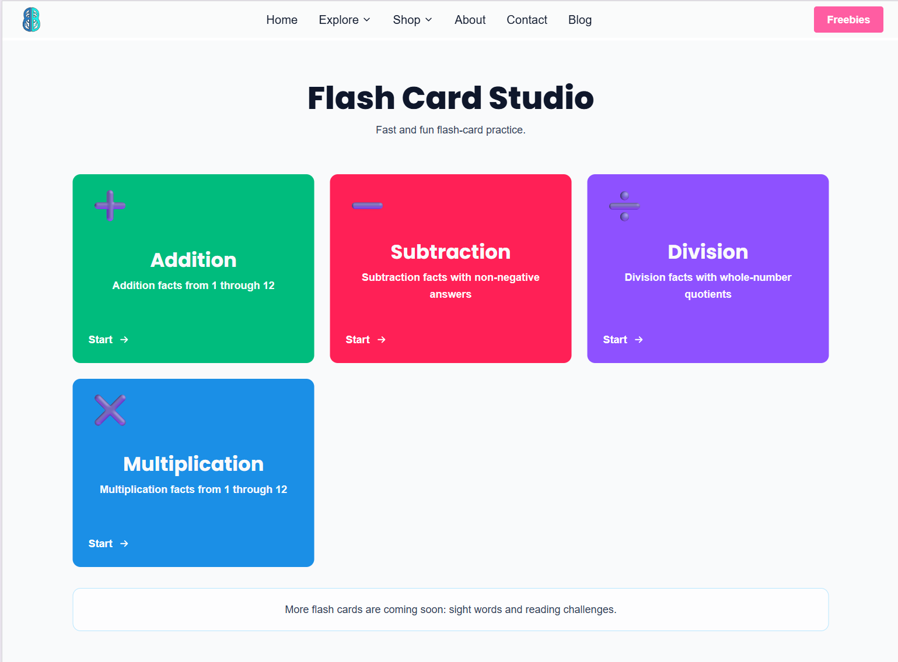
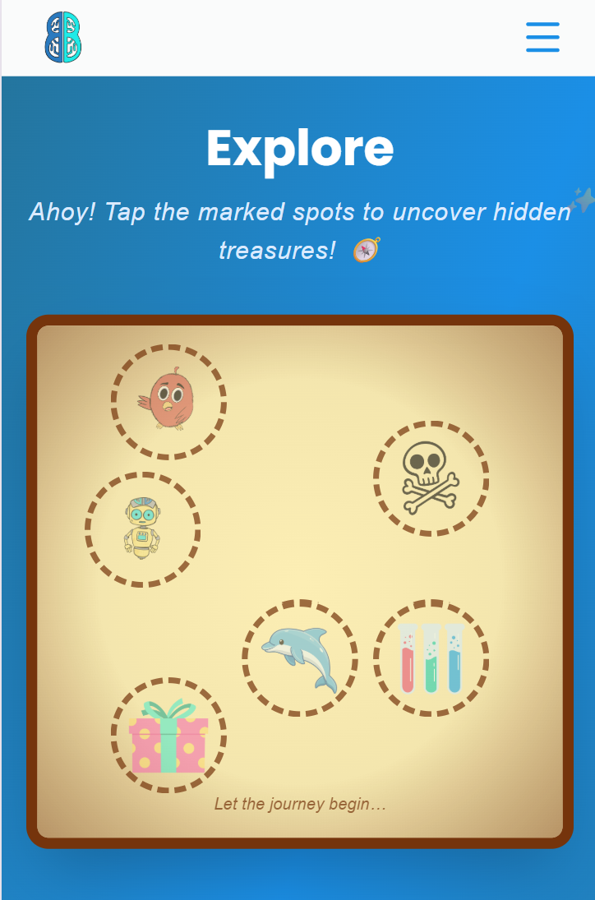
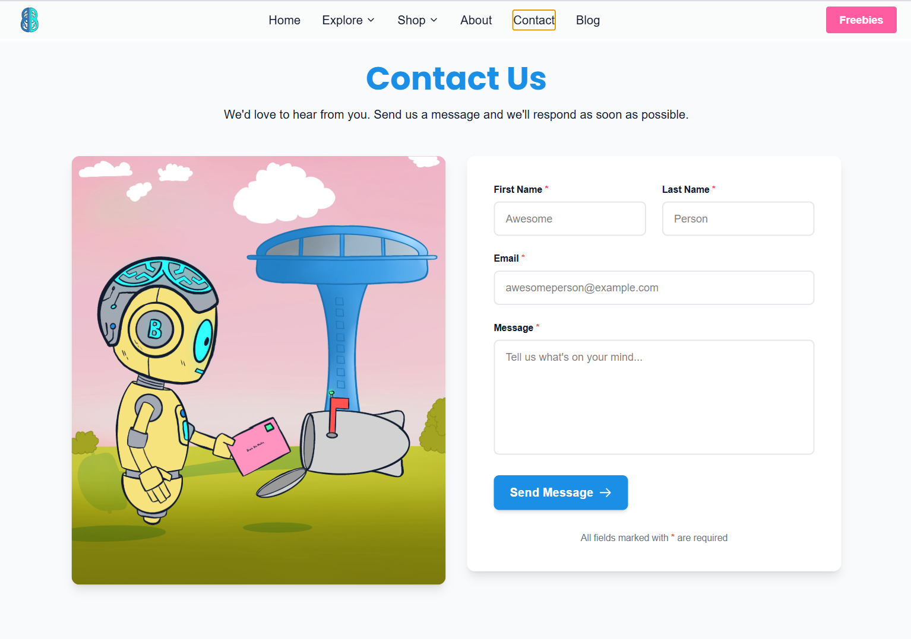

# Brain Bin Media
**Live Project:** [BrainBinMedia.com](https://BrainBinMedia.com)

Brain Bin Media is a polished, multi-page web application built for families and young learners — blending education, storytelling, and interactive digital experiences under a cohesive brand identity. The project demonstrates full-stack capability, product thinking, and a strong eye for UX across a content-rich, production-deployed application.

> Built with an AI-assisted development workflow (GitHub Copilot) to accelerate implementation, sharpen component structure, and maintain consistent polish throughout.

---

## What This Project Includes

### 1. Brand-Focused Home Experience
- Visually rich landing page with animated sections and a strong, child-friendly brand identity
- Clear calls to action that guide users naturally through the site
- A welcoming aesthetic designed for both kids and their parents

### 2. Interactive Learning Features
- Dedicated pages ("The Lab," "Flash Cards") featuring educational games and activities
- Experiences include quizzes, memory games, breathing exercises, emotion-based activities, logic puzzles, and a story creation tool
- Playful UX that makes learning feel fun rather than academic

### 3. Content and Discovery Pages
- An Explore page surfacing books, activities, and curated content paths
- A blog section with structured article layouts and a clean reading experience
- A shop section presenting books and products in a modern, conversion-friendly format

### 4. Free Resources and Email Engagement
- A Freebies section with downloadable materials
- Subscription-gated access for select resources
- Email capture and confirmation workflows built for real audience growth

### 5. Full-Stack Data Integration
- Supabase PostgreSQL backend handling email subscription storage
- Server-side API endpoints with safe, validated database interactions
- Demonstrates full-stack capability well beyond frontend development alone — real data persistence, validation logic, and user engagement workflows

### 6. Modern Frontend Architecture
- Responsive, mobile-first React UI with smooth navigation and page transitions
- Performance-conscious component loading and route-based code organization
- Analytics integration and server-side-style API handling for subscriptions and dynamic content

### 7. Production Deployment on Netlify
- Structured for smooth hosting with Netlify Forms, Edge Functions, and API-based integrations
- Environment variables and secure config handling keep sensitive data protected
- Reflects real comfort with modern deployment workflows, serverless features, and building applications that are reliable and ready for real clients

---

## Tech Highlights

| Area | Stack / Tools |
|---|---|
| Frontend | React, responsive CSS, motion/animation |
| Backend | Supabase (PostgreSQL), server-side API endpoints |
| Deployment | Netlify (Forms, Edge Functions, environment config) |
| Dev Workflow | GitHub Copilot (AI-assisted development) |
| Features | Email capture, subscription gating, downloadable resources, interactive games |

---

## Why This Project Matters for Clients

This project isn't just a demo — it's a live, deployed product built to serve real users. It shows:

- **Product scope:** Multi-page app with a cohesive brand, not just a landing page
- **Full-stack range:** From animated UI to database-backed subscriptions
- **Deployment fluency:** Production-ready, not just "it works on localhost"
- **User focus:** Built for a specific audience (families/kids) with intentional UX decisions throughout
- **Modern workflow:** Comfortable using AI tooling to ship faster without sacrificing quality

---

## Home Page

---

## Flash Cards Game

---

## Mobile View

---

## Contact Page

